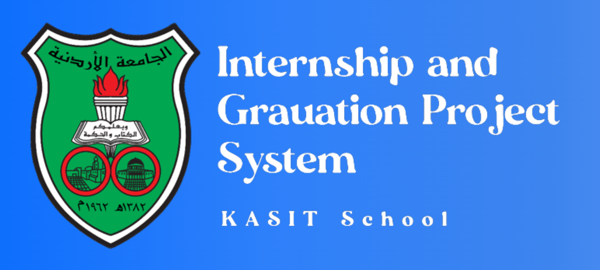

# Grarduation Project and Internship System




**Created By :** Belal Shakra  
**Email :**


## Overview

Graduation-Project-and-Internship-System aims to transform the gradution project and internhsip procedurals to digital procedurals in KASIT school (King Abdullah II School of Information Technology) at Jordan University.  

The project have three type of users: student, supervisor, and head of the department.  

The student can register his graduation project idea, his team, and supervisors. Also he can register the internship, wether in the company or technical courses.  
After regitering the graduation project, the students and supervisors can create a posts to follow project progress with each other.  

The supervisor can dispaly graduation project teams that supervise them, and its full details including its timeline. Also he can display internship students that belong to him and them reports, including the report of the compnay and courses details, and take a note for it (acceptance or rejection).  

The head of the department can sets all department info such as: starting date and ending date for registering the graduation proejct and internship forms, the max number of students in the graduation project team, and the internship week. Also he can displays the statistics of the department.  
Also he can displays the students that eceed 90 hour (so can register in this two university courses), and all graduatioin project teams that belong to department and its full details (excluding timeline).  
In addition, can set the supervisor for all students for internship displays the internship student that belong to department and them full reports.  


## Installation

To get started, clone this repository.

```
git clone git@github.com:belal-shakra/Graduation-Project-and-Internship-System.git
```

Next, configure your Database connection in `.env` file.

```
DB_CONNECTION=mysql
DB_HOST=127.0.0.1
DB_PORT=3306
DB_DATABASE=YOUR-DATABASE-NAME
DB_USERNAME=YOUR-DATABASE-USERNAME
DB_PASSWORD=YOUR-DATABASE-PASSWROD
```

## Run Packages and helpers

You have to all used packages and load helpers as below.

```
composer install
npm install
npm run build
```

## Generate new application key

You have to generate new application key as below.

```
php artisan key:generate
```

## Run Seeders

You have to run seeders as below.

```
php artisan db:seed
```

## Run Migrations

You have to run all the migration files included with the project and also run seeders as below.

```
php artisan migrate
```

## Important Notes

* The project considers the student and supervisors and some other info already registered in the univresity database, so to use the website you must run all previouse commands, and enter the database to get the email for student, supervisor and department head.  

* By default, all passwords are 123.  

* To enter website use these urls :
  * for student side : 127.0.0.1/
  * for supervisor side : 127.0.0.1/supervisor
  * for department side : 127.0.0.1/department